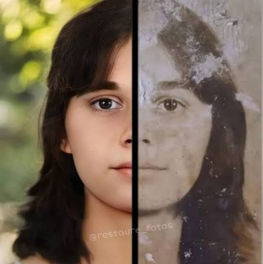

# 🛠️ Trabalho: Personalizando um site com HTML e CSS

Neste trabalho vocês vão pegar um site pronto (um *template*) e transformá-lo no site
de **outro estabelecimento** — por exemplo: petshop, açaiteria, hamburgeria, barbearia,
floricultura, etc. Cada aluno/dupla fica com um tipo **diferente**.

O template base é o **Business Casual** (um site de cafeteria), que já está
disponível no repositório do professor:
👉 https://github.com/ProfessorDurvaldo/Template-Cafeteria

> Quer ver como o template fica antes de mexer? Dá uma olhada na demo do original:
> https://startbootstrap.com/previews/business-casual

O objetivo é vocês **alterarem os textos, as imagens e as cores** para que o site
tenha a "cara" do estabelecimento escolhido — e, de quebra, praticar o uso do
**Bootstrap** pra ajustar o visual sem precisar escrever CSS. Ninguém precisa criar
nada do zero: o desafio é **entender o código que já existe e modificá-lo**.

---

## ✅ Resumo do que precisa ser feito

- [ ] Baixar e abrir o template no navegador
- [ ] Trocar **todos os textos** (nome, descrições, botões, rodapé...)
- [ ] Trocar **as imagens** pelas do seu estabelecimento
- [ ] Mudar **as cores** para combinar com o tema
- [ ] Usar **classes do Bootstrap** para ajustar layout e aparência
- [ ] Conferir se funciona em todas as páginas
- [ ] Entregar (ver seção "Como entregar" no final)

---

## Passo 1 — Baixar o template

O template já está pronto no GitHub do professor. É só baixar:

1. Acesse: https://github.com/ProfessorDurvaldo/Template-Cafeteria
2. Clique no botão verde **Code** → **Download ZIP**.
3. O arquivo `.zip` vai baixar. **Descompacte** (botão direito → Extrair).
4. Abra a pasta no **VS Code** (Arquivo → Abrir Pasta).
5. Dê dois cliques no `index.html` para abrir no navegador e ver o site rodando.

> 🧑‍💻 Quem já manja de Git pode clonar em vez de baixar o ZIP:
> ```
> git clone https://github.com/ProfessorDurvaldo/Template-Cafeteria.git
> ```

> 💡 Dica: instalem a extensão **Live Server** no VS Code. Aí o site atualiza
> sozinho toda vez que você salva um arquivo — muito mais prático que ficar
> apertando F5.

---

## Passo 2 — Conhecer os arquivos

Ao abrir a pasta, vocês vão encontrar mais ou menos isto:

```
📁 seu-projeto/
├── 📄 index.html        ← página inicial (Home)
├── 📄 about.html        ← página "Sobre"
├── 📄 products.html     ← página "Produtos"
├── 📄 store.html        ← página "Loja"
├── 📁 css/
│   └── 📄 styles.css    ← AQUI ficam as CORES e o estilo
├── 📁 js/
│   └── 📄 scripts.js    ← não precisam mexer
└── 📁 assets/
    ├── 📄 favicon.ico   ← ícone da abinha do navegador
    └── 📁 img/          ← AQUI ficam as IMAGENS
        ├── intro.jpg
        ├── about.jpg
        ├── bg.jpg
        ├── products-01.jpg
        ├── products-02.jpg
        └── products-03.jpg
```

**Regra de ouro:**
- Mexeu em **texto** ou **imagem**? → arquivos `.html`
- Mexeu em **cor** ou **aparência**? → arquivo `css/styles.css`

---

## Passo 3 — Trocar os textos

Abra cada arquivo `.html` e procure os textos em inglês para substituir pelos seus.
No `index.html`, por exemplo, você vai achar coisas como:

**Título da aba do navegador** (lá no topo, dentro de `<title>`):
```html
<title>Business Casual - Start Bootstrap Theme</title>
```
Troque por:
```html
<title>Pet Feliz - Petshop e Banho e Tosa</title>
```

**Nome do site / cabeçalho** (as linhas com `site-heading`):
```html
<span class="site-heading-upper text-primary mb-3">A Free Bootstrap Business Theme</span>
<span class="site-heading-lower">Business Casual</span>
```
Troque pelo nome e slogan do seu estabelecimento.

**Menu, títulos das seções, parágrafos e botões:** vá lendo o HTML e trocando tudo
que for texto visível. Alguns pontos que sempre precisam mudar:
- o nome no menu (navbar)
- os títulos das seções (ex.: "Fresh Coffee" / "Worth Drinking")
- os parágrafos de descrição
- o texto do botão (ex.: "Visit Us Today!")
- o rodapé (ex.: `Copyright © Your Website 2023` → nome do estabelecimento e ano atual)

> ⚠️ **Cuidado:** só troque o texto que fica **entre** as tags `> ... <`.
> Não apague as tags (`<span>`, `<p>`, `<a>`...) nem as `class`, senão o layout quebra.
>
> ✅ Certo: `<p>Melhor açaí da cidade</p>`
> ❌ Errado: `Melhor açaí da cidade` (apagou o `<p>`)

**Repita o processo nas 4 páginas:** `index.html`, `about.html`, `products.html` e `store.html`.

---

## Passo 4 — Trocar as imagens

As imagens ficam todas na pasta `assets/img/`. Onde cada uma aparece:

| Arquivo             | Onde aparece                          |
|---------------------|---------------------------------------|
| `intro.jpg`         | imagem grande da página inicial       |
| `about.jpg`         | imagem da página "Sobre"              |
| `bg.jpg`            | imagem de fundo do site               |
| `products-01/02/03.jpg` | fotos dos produtos                |
| `favicon.ico`       | ícone da aba do navegador             |

**Como trocar (jeito mais fácil):**
1. Baixe as imagens novas do seu estabelecimento.
2. Renomeie a imagem nova com o **mesmo nome** da antiga (ex.: `intro.jpg`).
3. Cole dentro de `assets/img/` substituindo a original. Pronto!

> 💡 Se preferir manter os nomes das suas imagens, você pode em vez disso editar o
> `src` no HTML. Ex.: `` vira ``.

**Onde achar imagens grátis (sem problema de direitos autorais):**
- https://unsplash.com
- https://pexels.com
- https://pixabay.com

> 📏 **Dica de tamanho:** use imagens de boa qualidade, mas não gigantes.
> Fotos acima de ~1MB deixam o site lento. Se precisar, comprima em
> https://tinypng.com antes de usar. Tente manter proporções parecidas com a
> imagem original para não deformar o layout.

---

## Passo 5 — Mudar as cores 🎨

As cores ficam no arquivo **`css/styles.css`**. Este template usa **duas cores principais**:

| Cor original | Onde é usada                                  |
|--------------|-----------------------------------------------|
| `#e6a756`    | cor de **destaque** (dourado): botões, títulos, menu |
| `#2F170F`    | cor **escura** (marrom): fundos e detalhes    |

**Como trocar do jeito certo (Localizar e Substituir):**
1. Abra `css/styles.css` no VS Code.
2. Aperte **Ctrl + H** (Localizar e Substituir).
3. No campo de cima digite `#e6a756`, no de baixo a sua nova cor de destaque.
4. Clique em **Substituir Tudo** (o ícone com as duas setinhas).
5. Repita para `#2F170F` com a sua nova cor escura.
6. Salve e veja o resultado no navegador.

> ⚠️ Essa cor aparece **várias vezes** no arquivo — por isso use "Substituir Tudo",
> não vá trocando uma por uma.

**Como escolher cores que combinam:**
- Pense na identidade do lugar: açaiteria → roxo; hamburgeria → vermelho/amarelo;
  petshop → azul/verde; floricultura → verde/rosa; barbearia → preto/dourado.
- Use um gerador de paletas: https://coolors.co
- Pra pegar o **código hexadecimal** de uma cor (ex.: `#8e44ad`), use o
  seletor do https://htmlcolorcodes.com

> 🔎 Existem ainda umas variações mais escuras dessas cores no CSS
> (usadas quando você passa o mouse nos botões). Se sobrar tempo e você quiser um
> acabamento caprichado, procure também por `#8a6434` e `#1c0e09` e troque por
> tons um pouco mais escuros das suas cores novas.

---

## Passo 6 — Turbine o site com Bootstrap 🅱️ (sem escrever CSS!)

Este template **já vem com o Bootstrap incluído**. Na prática, isso quer dizer que
você consegue mudar MUITA coisa na aparência só adicionando **classes** nas tags
HTML — sem precisar mexer no arquivo CSS.

**O que é uma classe?** É aquele pedacinho `class="..."` dentro da tag. As palavras
ali dentro são comandos de estilo do Bootstrap. Você pode juntar várias, separadas
por espaço:

```html
<p class="text-center fw-bold text-primary">Texto centralizado, negrito e colorido</p>
```

> 💥 **Dica de ouro:** com o **Live Server** ligado, adicione uma classe, salve e
> veja a mágica acontecer na hora. É a melhor forma de aprender: testando!

Abaixo, um "kit de sobrevivência" das classes mais úteis pra este trabalho 👇

### 📝 Formatar texto
| Classe | O que faz |
|--------|-----------|
| `text-center` `text-start` `text-end` | alinha o texto (centro, esquerda, direita) |
| `text-uppercase` `text-capitalize` | MAIÚSCULAS / Primeira Letra Maiúscula |
| `fw-bold` `fw-light` `fst-italic` | negrito / fino / itálico |
| `fs-1` até `fs-6` | tamanho do texto (`fs-1` é o maior) |

```html
<h2 class="text-center text-uppercase fw-bold">Nosso Cardápio</h2>
```

### 🎨 Cores de texto e de fundo
- **Texto:** `text-primary` `text-dark` `text-white` `text-success` `text-danger`
- **Fundo:** `bg-primary` `bg-dark` `bg-light` `bg-success` `bg-warning`

```html
<p class="bg-dark text-white p-3 rounded">Aberto todos os dias das 8h às 22h!</p>
```

> Neste template, `primary` é a **cor de destaque** (o dourado). Se você já trocou a
> cor lá no Passo 5, as classes `text-primary` e `bg-primary` mudam junto. 😉

### 📏 Espaçamento (margem e "respiro")
Fórmula: **letra + direção + tamanho**
- Letra: `m` = margem (por fora) · `p` = padding (por dentro)
- Direção: `t` topo · `b` baixo · `s` esquerda · `e` direita · `x` lados · `y` cima e baixo
- Tamanho: de `0` a `5`

Exemplos: `mt-4` (margem no topo), `mb-5` (margem embaixo), `p-3` (espaço interno), `py-5` (espaço em cima e embaixo).

```html
<div class="p-4 mb-3 bg-light rounded">Um bloco bem espaçado</div>
```

### 🔘 Botões
```html
<a href="#" class="btn btn-primary btn-lg">Peça já</a>
<a href="#" class="btn btn-outline-dark">Ver mais</a>
```
- Cor: troque `btn-primary` por `btn-dark`, `btn-success`, `btn-danger`...
- Tamanho: `btn-lg` (grande) ou `btn-sm` (pequeno)
- `btn-outline-...` deixa o botão só com a borda (vazado)

### 🧱 Colocar coisas lado a lado (grid de 12 colunas)
O Bootstrap divide a largura da tela em **12 colunas**. Você agrupa em `row` (linha)
e distribui em `col`:

```html
<div class="row">
  <div class="col-md-6">Metade da tela</div>
  <div class="col-md-6">A outra metade</div>
</div>
```
- `col-md-6` = 2 colunas (12 ÷ 6) · `col-md-4` = 3 colunas · `col-md-3` = 4 colunas
- No **celular** ele empilha tudo sozinho automaticamente. 📱

### 🃏 Cards — perfeitos pra mostrar produtos!
```html
<div class="card" style="width: 18rem;">
  
  <div class="card-body">
    <h5 class="card-title">Nome do produto</h5>
    <p class="card-text">Uma descrição curtinha e caprichada.</p>
    <a href="#" class="btn btn-primary">Comprar</a>
  </div>
</div>
```

### 🏷️ Badges (etiquetas de "Novo", "Promoção"...)
```html
<span class="badge bg-success">Novo</span>
<span class="badge bg-danger">Promoção</span>
```

### 📚 Onde consultar TODAS as classes
Ninguém decora isso — a gente **consulta e copia**. Guarde estes links:
- Documentação oficial (com exemplos): https://getbootstrap.com/docs/5.3/
- Tutorial pra iniciante (bem didático): https://www.w3schools.com/bootstrap5/

> 🎯 **O combinado do trabalho:** capriche em usar as classes do Bootstrap pra
> deixar o site com a sua cara. Não vale entregar tudo igualzinho ao original! 😄

---

## ⭐ Bônus — Trocar as fontes (opcional)

O template usa as fontes **Raleway** (títulos) e **Lora** (textos), carregadas pelo
Google Fonts no `<head>` de cada página. Quem quiser deixar mais personalizado pode:
1. Escolher fontes em https://fonts.google.com
2. Substituir os `<link>` do Google Fonts no `<head>`.
3. Trocar o nome das fontes no `css/styles.css` (procure por `Raleway` e `Lora`).

---

## 💡 Dicas gerais

- **Salve sempre (Ctrl + S)** e atualize o navegador pra ver as mudanças.
- **Mexa aos poucos:** faça uma alteração, veja se funcionou, depois a próxima.
  Assim, se quebrar algo, você sabe exatamente o que foi.
- **Faça uma cópia da pasta** antes de começar a mexer. Se der ruim, você tem o backup.
- **Teste no celular:** aperte F12 no navegador e ative o modo responsivo pra ver
  como fica na tela pequena.
- **Coerência é tudo:** nome, imagens, cores e textos devem falar do *mesmo*
  estabelecimento. Nada de sobrar "coffee" ou foto de café num site de petshop 😉
- **Trabalho em dupla?** Combinem quem faz o quê (ex.: um cuida dos textos, outro
  das imagens e cores) pra não editar o mesmo arquivo ao mesmo tempo.

---

## 📋 Checklist antes de entregar

- [ ] O título da aba (`<title>`) foi trocado em **todas** as páginas
- [ ] Não sobrou **nenhum** texto em inglês do template original
- [ ] Todas as imagens foram trocadas pelas do meu estabelecimento
- [ ] As cores combinam com o tema escolhido
- [ ] Usei classes do **Bootstrap** para personalizar (não deixei tudo igual ao original)
- [ ] O rodapé tem o nome do estabelecimento e o ano atual
- [ ] Testei as 4 páginas e todos os links do menu funcionam
- [ ] O layout não quebrou (nenhuma tag apagada por engano)

---

## 📤 Como entregar

1. Confira o checklist acima.
2. Compacte a pasta inteira do projeto em um `.zip`.
3. Renomeie o arquivo assim: `trabalho-site_SEUNOME.zip`
4. Envie [na plataforma / e-mail / conforme combinado em aula].

**Bom trabalho! 🚀**
